# Mi Proyecto de Python: Clases y Objetos

## ¿Cómo se diseño?
Para este proyecto usamos la Programación Orientada a Objetos (POO), en lugar de tener un montón de código suelto, creamos "moldes" llamados Clases las cuales son usadas para representar cosas de la vida real, como un Libro o una Cuenta de Banco.

* **Clases:** Son los planos del programa (como el plano de una casa).
* **Objetos:** Son las versiones reales de esos planos (como la casa ya construida).
* **Métodos:** Son las acciones que pueden hacer los objetos (prestar, devolver, depositar).
* **Init:** Es lo que prepara al objeto apenas lo creamos para que no tenga errores.

---

## Ejemplos de Ejecución (Capturas en Consola)

---

<b>📂 Capturas de los talleres</b>

 

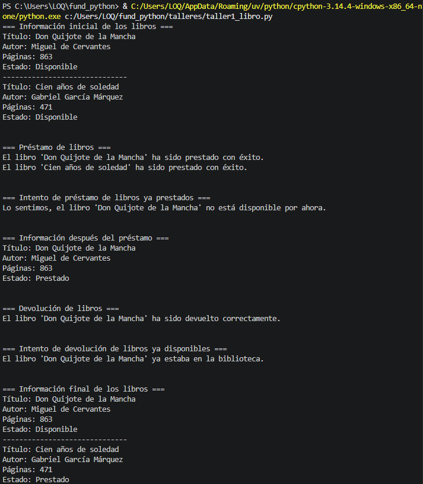
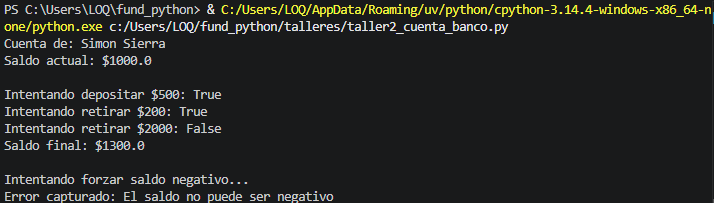

<b>📂 Capturas de los ejemplos</b>

 

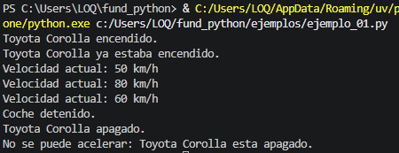
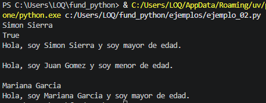
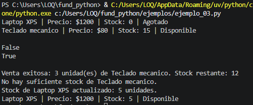
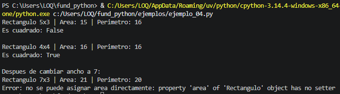
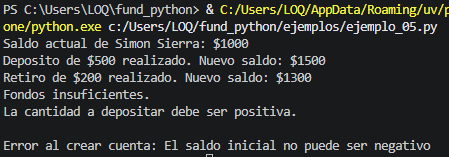
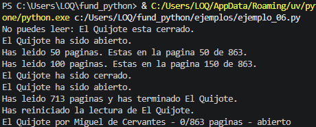
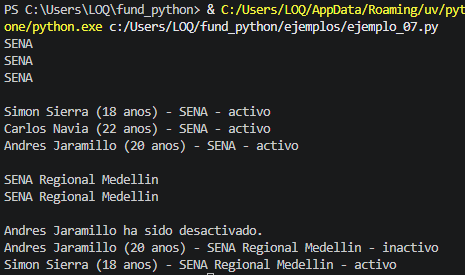
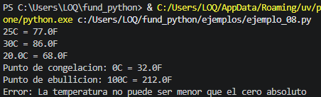
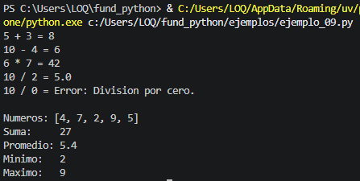
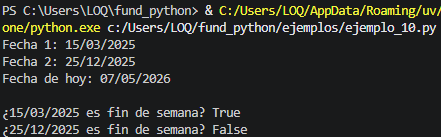
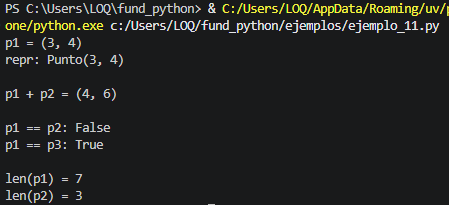
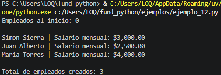
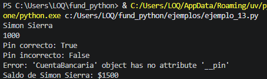
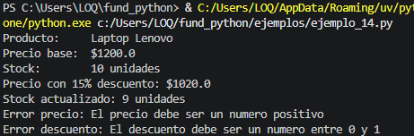
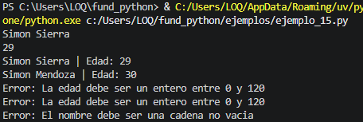
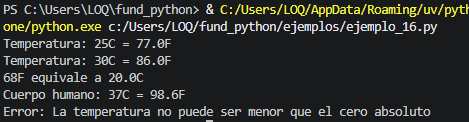
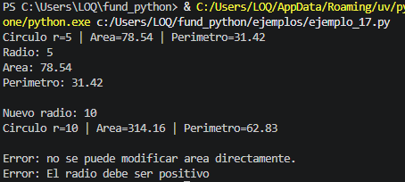
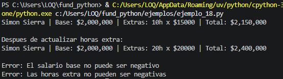
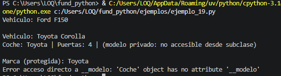
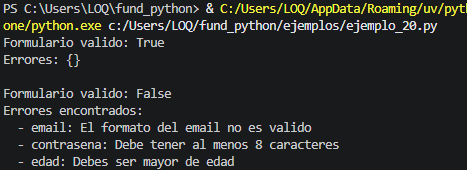

<b>📂 Capturas del proyecto final</b>

 

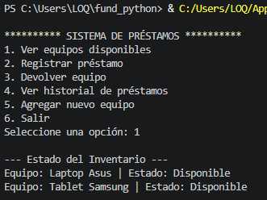
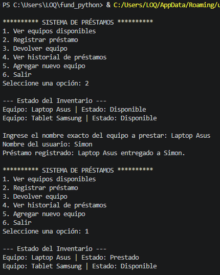
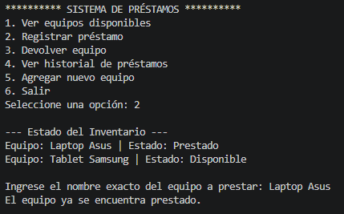
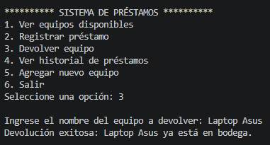
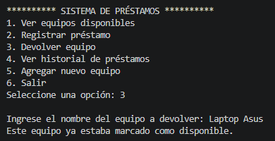
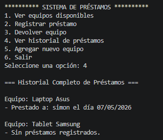
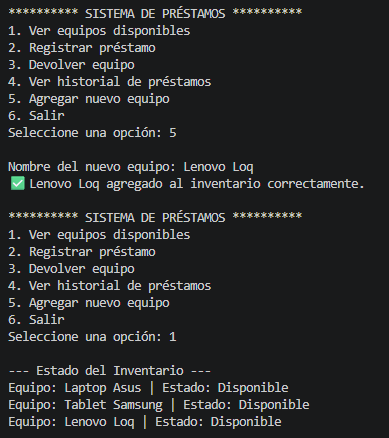

---

## Reflexión Personal
Hacer este proyecto me sirvió para entender que programar orientado a objetos es mucho más ordenado y simplifica mucho mas el codigo.

Aprendí a crear códigos que se pueden volver a usar en otros proyectos o en el mismo pero en distintas partes del mismo. 